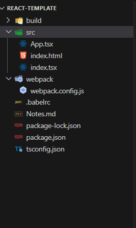

**1. React wit Babel**
a. Install these dependencies

```bash
    npm init --y
    npm add react react-dom
    npm add -D typescript @types/react @types/react-dom
    npm add -D @babel/core @babel/preset-env @babel/preset-react @babel/preset-typescript
```

---

**Add tsconfig configuration file**

1. Add below configuration

```json
{
  "compilerOptions": {
    "target": "ES5" /* Specify ECMAScript target version: 'ES3' (default), 'ES5', 'ES2015', 'ES2016', 'ES2017', 'ES2018', 'ES2019', 'ES2020', or 'ESNEXT'. */,
    "module": "ESNext" /* Specify module code generation: 'none', 'commonjs', 'amd', 'system', 'umd', 'es2015', 'es2020', or 'ESNext'. */,
    "moduleResolution": "node" /* Specify module resolution strategy: 'node' (Node.js) or 'classic' (TypeScript pre-1.6). */ /* Type declaration files to be included in compilation. */,
    "lib": [
      "DOM",
      "ESNext"
    ] /* Specify library files to be included in the compilation. */,
    "jsx": "react-jsx" /* Specify JSX code generation: 'preserve', 'react-native', 'react' or 'react-jsx'. */,
    "noEmit": true /* Do not emit outputs. */,
    "isolatedModules": true /* Transpile each file as a separate module (similar to 'ts.transpileModule'). */,
    "esModuleInterop": true /* Enables emit interoperability between CommonJS and ES Modules via creation of namespace objects for all imports. Implies 'allowSyntheticDefaultImports'. */,
    "strict": true /* Enable all strict type-checking options. */,
    "skipLibCheck": true /* Skip type checking of declaration files. */,
    "forceConsistentCasingInFileNames": true /* Disallow inconsistently-cased references to the same file. */,
    "resolveJsonModule": true
    // "allowJs": true /* Allow javascript files to be compiled. Useful when migrating JS to TS */,
    // "checkJs": true /* Report errors in .js files. Works in tandem with allowJs. */,
  },
  "include": ["src/**/*"]
}
```

---

**Add .babelrs file for babel configuration**

1. Add below configuration
   ```javascript
   {
   "presets": [
       "@babel/preset-env",
       [
           "@babel/preset-react",
           {
               "runtime":"automatic"
           }
       ],
       "@babel/preset-typescript"
   ]
   }
   ```

---

**Install Webpack dependencies as dev dependencies**

```bash
npm add -D webpack webpack-cli webpack-dev-server html-webpack-plugin

npm add -D babel-loader

```

---

Folder and files to be there


---

**Package json - add script to start the Application**

```json
"scripts": {
    "start": "webpack serve --config webpack/webpack.config.js --open",
    "test": "echo \"Error: no test specified\" && exit 1"
  },
```

---

**Add css and style loader to make CSS work**

```bash
npm add -D css-loader style-loader
```
